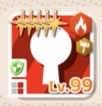

# 工夫した点と検知した問題点

## 0、セットアップ手順

- nodejs 最新更新
- React環境構築 vite インストール
- tailwindcss インストール
- git init
- src ファイルへ DLした画像の格納
- configファイル適用
- 後述する Phase 0 の構築. npm run dev で検証できる環境
( Phase 0: 環境整備（フォント移動、CSS修正、App.tsx白紙化）   )

## 1、検知した問題点

1、lt-ranking-base.png  
角丸の形状が右下とそれ以外で異なります。  
正しい画像ファイルが提供されれば修正します。

2、redcircle.png  
ダウンロード元のファイルから壊れていたので、仮に自作しました。  
正しい画像ファイルが提供されれば修正します。

3、title-base.png  
手本PDFとは異なる画面のタイトル画像かと思いました。  
正しい画像ファイルが提供されれば修正します。

上記の代わりに、仮で自作しました。  
title-base\_genarated.png

4、lt-bg.png  
色合いが手本とかなり異なっていたので、色合い調整して生成しました。  
lt-bg-2.png  
正しい画像ファイルが提供されれば修正します。

## 2、実装にあたって工夫した点

2-1. キャラクターアイコンの表示は、仕様が複雑なので、保守性を上げるべく "CharacterIcon.tsx" として切り出しました。 メインのコンポーネントは、LuneTower.tsx です。  

2-2, 画像素材に対するShadow   
下記 定義だと、透過領域画像に適用した場合、Shadow のつきかたが、透過領域についてしまう。  
.context-menu {  
animation: fadeIn 0.1s ease-out;  
box-shadow: 0 4px 6px rgba(0, 0, 0, 0.3);  
z-index: 9999;  
}

これに対して 以下を定義し、透過画像の非透過領域に対して影がつくようになった  
/\* drop shadow \*/  
.context-menu-ds {  
animation: fadeIn 0.1s ease-out;  
filter: drop-shadow(3px 3px 4px rgba(0, 0, 0, 0.3));  
z-index: 9999;  
}

2-3, 以下行は、あるとスクロールバーのカスタマイズが効かなかったため iOS Android向けスマホゲーム仕様という理解でコメントアウトしてスクロールバーのカスタマイズを行いました。

/\* Firefox \*/

/\* .mq-story-scrollbar {

scrollbar-width: auto;

scrollbar-color: #f5f0ea #2a1f18;

} \*/

  
  

2-4, 実装フェーズを6段階に分けて、保守性を高める実装を試みました。

Phase 0: 環境整備（フォント移動、CSS修正、App.tsx白紙化）  
Phase 1: 全体レイアウト構造（背景、ヘッダー/メイン分割）  
Phase 2: ヘッダー部分を実装中  
Phase 3: ランキングタイトル + タブ + シーズン + ページネーション  
Phase 4: 左カラム（世界ランク + マイデータ）  
Phase 5: ランキングリスト（スクロール可能、10人分、キャラ×7）  
Phase 6: 微調整・仕上げ（text-shadow、フォント、レスポンシブ確認）

## 3、仕様に関するご提案

  

**使用キャラクター表示について**

キャラクター画像と属性背景の管理方法について、以下の理由から**1枚の合成画像での管理**を提案いたします。

* * *

#### 3-1. パフォーマンス面

- ランキング画面では複数ユーザー × 最大8キャラを表示するため、画像リクエスト数が多い
- キャラ + 背景を別々に取得・合成すると、データ量・処理負荷が増加
- 1枚画像であれば、表示速度の向上が見込める

* * *

#### 3-2. ゲーム仕様の観点

一般的なソーシャルゲームでは、同一キャラクターでも属性違いは**別デザイン（または派生デザイン）** で提供されることが多いです。

- 属性違いキャラは、ガチャ課金の訴求要素となる
- ユーザー（キャラのファン）は「新しい見た目」に価値を感じる
- 同じ立ち絵で背景だけ変わる仕様は、課金動機として弱い

* * *

#### 3-3. 提案する構成

| 要素  | 管理方法 |
| --- | --- |
| キャラクター + 属性背景 | **1枚画像**（合成済み） |
| 背景なしキャラ画像 | 必要に応じて別途保持 |
| レアリティ（星マーク） | 別画像 |
| 属性アイコン（火・水等） | 別画像 |
| 攻撃タイプアイコン | 別画像 |
| ポジションタイプアイコン | 別画像 |
| 職業タイプアイコン | 別画像 |

* * *

#### まとめ

キャラクターと属性背景を1枚画像で管理することで、**パフォーマンス向上**と**課金設計との整合性**を両立できると考えます。

保守性・拡張性については、アイコン類を別画像で管理することで十分に担保可能です。

* * *

&nbsp;

ーーー